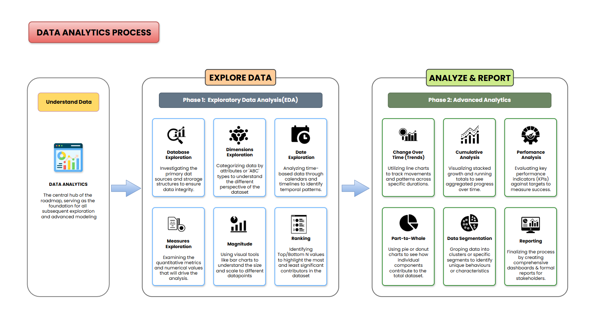

# 📊 SQL-Data-Analytics-Project

## 🚀 Overview

This project demonstrates a complete **Data Analytics workflow using SQL**, where raw data is transformed into meaningful insights through structured querying and analytical techniques.

Instead of treating queries as isolated tasks, the project follows a **logical, step-by-step analytical progression**, where each query builds upon the previous one—mirroring how real-world data analysts approach problem-solving.

---

---

## 📂 The Analytical Workflow

### 1. Data Exploration (Discovery Phase)
Understanding the dataset's structure and boundaries before performing deeper calculations.
* **Schema Audit:** Identified available tables, column structures, and data sources.
* **Data Profiling:** Verified unique business segments, categories, and date ranges to establish baseline metrics.

### 2. Performance & Contribution Analysis
Evaluating how different products, categories, and business units drive revenue.
* **Product Rankings:** Applied ranking functions to isolate top and bottom-performing products.
* **Revenue Share:** Calculated category performance and percentage contributions to total sales.
* **Geographic Distribution:** Compared performance across regional business units.

### 3. Trend & Growth Analysis
Introducing the time dimension to monitor business progression and momentum over time.
* **Time-Series Tracking:** Analyzed daily and monthly sales trends to spot seasonal patterns.
* **Cumulative Metrics:** Applied window functions to calculate running totals and track ongoing growth.

### 4. Customer Segmentation
Applying conditional business logic to organize rows into meaningful target groups.
* **Value Brackets:** Classified customers into "High Value" or "Low Value" segments based on purchasing thresholds to support targeted business strategies.

### 5. Consolidated Executive Reporting
Bringing the entire analytical journey together into a clean summary for decision-making.
* **Final Summary:** Generated unified reports combining total sales metrics, order counts, and category summaries into a single view.

---

## 🎯 What You Will Learn

By exploring this workflow, you will see how to:
* **Audit & Profile Data:** Efficiently map out and understand an unfamiliar database structure.
* **Write Analytical Queries:** Master window functions to calculate running totals, rankings, and percentage shares.
* **Apply Business Logic:** Use conditional statements to segment data and answer complex business questions.
* **Build Executive Summaries:** Translate raw business problems into clean, structured reporting metrics.

---

## 🧠 Core Competencies & Skills Demonstrated

* **Analytical Thinking:** Translating multi-step business problems into structured SQL solutions.
* **Advanced Querying:** Heavy usage of Window Functions, multi-level Aggregations, and conditional `CASE` statements.
* **Data Lifecycle Flow:** Moving cleanly from initial data exploration to final executive-level reporting layers.

---

## 🛠️ Technology Used
* **Languages & Frameworks:** T-SQL / SQL Server
* **Environment & Tools:** Relational Database Concepts, Git, GitHub

---

## 💼 Use Case

This project simulates a real-world scenario where a data analyst:

* Understands business data
* Performs analysis using SQL
* Generates insights for decision-making
* Builds structured and reusable queries

It is ideal for anyone preparing for **Data Analyst roles** and looking to showcase practical SQL skills.

---

## 🧠 Conclusion

This project demonstrates how SQL can be used to solve real-world analytical problems by:

* Structuring raw data into meaningful insights
* Applying step-by-step analytical thinking
* Using queries to answer business-driven questions

It highlights the practical role of SQL in turning data into actionable decisions.

---

## 🛡️ License
This project is licensed under the MIT License. You are free to use, modify, and share this project with proper attribution.
