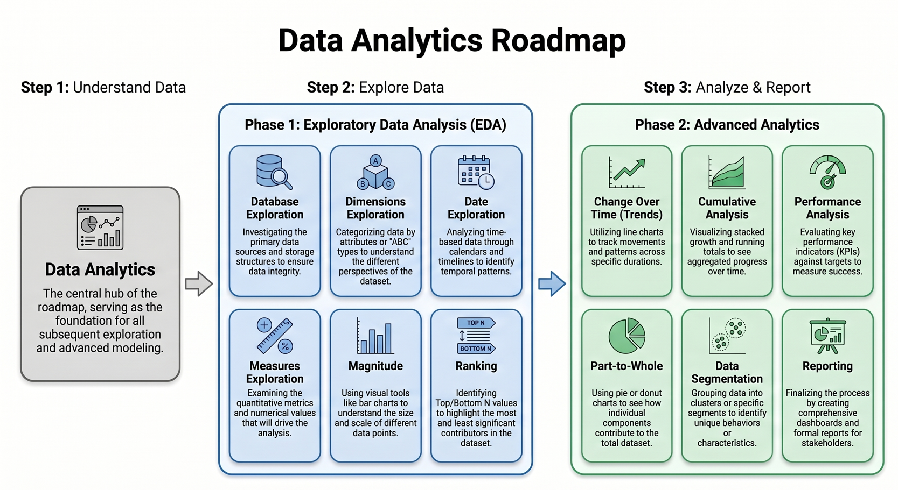

# 📊 SQL-Data-Analytics-Project

## 🚀 Overview

This project demonstrates a complete **Data Analytics workflow using SQL**, where raw data is transformed into meaningful insights through structured querying and analytical techniques.

Instead of treating queries as isolated tasks, the project follows a **logical, step-by-step analytical progression**, where each query builds upon the previous one—mirroring how real-world data analysts approach problem-solving.

---



## 🔍 Step 1: Understanding the Data (Exploratory Phase)

```sql
SELECT TABLE_NAME 
FROM INFORMATION_SCHEMA.TABLES;
```

Identifies all tables in the database, helping establish the starting point for analysis.

```sql
SELECT DISTINCT category
FROM products;
```

Extracts unique categories to understand available segments for analysis.

```sql
SELECT 
    YEAR(order_date) AS year,
    MONTH(order_date) AS month
FROM orders;
```

Introduces the time dimension for trend and seasonality analysis.

```sql
SELECT 
    SUM(sales) AS total_sales,
    AVG(sales) AS avg_sales
FROM orders;
```

Provides a high-level summary of overall performance.

---

## 📊 Step 2: Exploring Patterns and Comparisons

```sql
SELECT 
    product_name,
    RANK() OVER (ORDER BY sales DESC) AS rank
FROM products;
```

Ranks products to identify top and bottom performers.

```sql
SELECT 
    category,
    SUM(sales) AS total_sales
FROM products
GROUP BY category;
```

Compares performance across categories to identify key contributors.

---

## 📈 Step 3: Analyzing Trends and Growth

```sql
SELECT 
    order_date,
    SUM(sales) AS daily_sales
FROM orders
GROUP BY order_date
ORDER BY order_date;
```

Tracks how sales change over time to identify trends.

```sql
SELECT 
    order_date,
    SUM(sales) OVER (ORDER BY order_date) AS cumulative_sales
FROM orders;
```

Calculates cumulative growth to analyze progression over time.

---

## 📉 Step 4: Performance & Contribution Analysis

```sql
SELECT 
    region,
    SUM(sales) AS total_sales
FROM orders
GROUP BY region;
```

Evaluates performance across regions or business units.

```sql
SELECT 
    category,
    SUM(sales) * 100.0 / SUM(SUM(sales)) OVER() AS percentage
FROM products
GROUP BY category;
```

Calculates contribution percentage of each category to total sales.

---

## 🧩 Step 5: Segmentation & Business Logic

```sql
SELECT 
    customer_id,
    CASE 
        WHEN sales > 1000 THEN 'High Value'
        ELSE 'Low Value'
    END AS segment
FROM orders;
```

Segments customers into meaningful groups for targeted analysis.

---

## 📄 Step 6: Final Reporting

```sql
SELECT 
    category,
    SUM(sales) AS total_sales,
    COUNT(*) AS total_orders
FROM orders
GROUP BY category;
```

Generates a summary report combining key business metrics.

---

## 🧠 Key Focus of the Project

* Applying structured analytical thinking using SQL
* Leveraging window functions and aggregations
* Building a strong, portfolio-ready analytics workflow

---

## 🎯 What You Will Learn

By going through this project, you will learn how to:

* Explore and understand datasets using SQL
* Write efficient queries for analysis
* Apply window functions for advanced insights
* Perform trend, performance, and segmentation analysis
* Translate business problems into SQL solutions

---

## 💼 Use Case

This project simulates a real-world scenario where a data analyst:

* Understands business data
* Performs analysis using SQL
* Generates insights for decision-making
* Builds structured and reusable queries

It is ideal for anyone preparing for **Data Analyst roles** and looking to showcase practical SQL skills.

---

## 🧠 Conclusion

This project demonstrates how SQL can be used to solve real-world analytical problems by:

* Structuring raw data into meaningful insights
* Applying step-by-step analytical thinking
* Using queries to answer business-driven questions

It highlights the practical role of SQL in turning data into actionable decisions.
